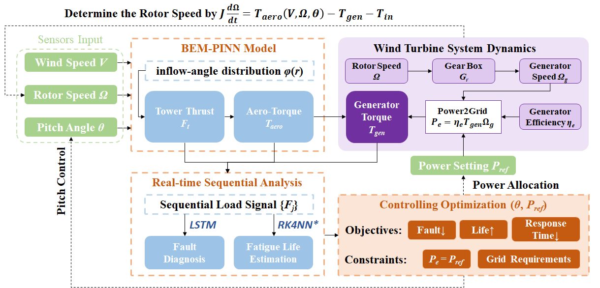
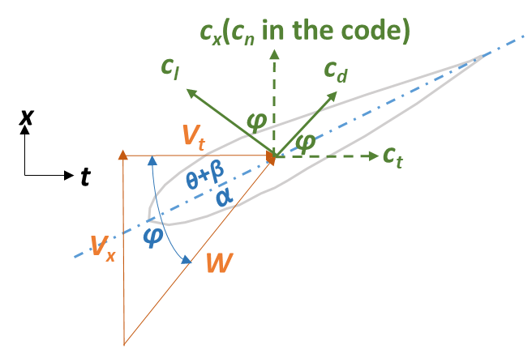

# 🔧 Technical Details of the PINN-LSTM Fault Diagnosis

> Detailed description corresponding to the extended abstract "ICOPE-2026-51023".

The whole workflow of this project (including the planning modules which has not yet been conducted):



> *See in the paper "G Y, et al. "Neural network approaches for real-time fatigue life estimation by Surrogating the rainflow counting method." International Journal of Fatigue 197 (2025): 108941."

## 🎯 The Principal of Wind Turbine Fault Detection

For wind turbines, the rotor dynamics obeys the following angular momentum equation:

```math
  J\frac{d\Omega}{dT} = T_{aero}(V, \Omega, \theta) - T_{gen} - T_{in}
```

where $T_{aero}$ is the torque at the aero-dynamics side, determined by the wind speed $V$, rotor speed $\Omega$ and the pitch angle $\theta$, while $T_{gen}, T_{in}$ denotes the torque of generator, and the dynamic loss (elastic, damping term etc.) respectively. 

The wind turbines is controlled by adjusting the pitch angle $\theta$ to capture the wind energy at a certain wind speed, and the rotor speed $\Omega$ is determined according to the previous dynamic equation.

Therefore, if the system experiences mechanical failure which leads to deviation of the dynamic constants, such as the rotor inertia $J$, the rotor speed $\Omega$ would drift at the same wind speed $V$ and pitch angle $\theta$, and further influence the mechanical quantities. Consequently, our objective is to diagnose the fault from the Tower Thrust $F_t$ and the Torque at the aero-dynamic side $T_{aero}$ signals in real-time.

## ⚙ The Design of BEM-PINN

To facilitate the real-time fault detection, first the of real-time computation of $F_t$ and $T_{aero}$ according to the signals from the sensors should be accessible. Traditional methods to calculate the wind turbine aero-dynamics with blade element momentum (BEM) model requires iterative calculation, which limits its speed of response. Therefore we conducted a PINN to surrogate BEM computation to accelerate this step, further enhancing the real-time monitoring of the system. First, let's recall the principal of BEM:

### 📝 BEM Principal

Conventional BEM introduces the axial and tangential inducible factors $a,b$ to quantify the corresponding components $V_x, V_t$ 

```math
  V_x = (1-a)V, V_t = (1+b)\Omega r,
```

which contribute to the inflow velocity $W$ and determine the inflow angle $\varphi$

```math
  W = \sqrt{V_x^2+V_t^2}, \varphi = \arctan \left(\frac{V_x}{V_t}\right).
```

Introducing the aerodynamic twist $\beta(r)$ (determined during designing stage), then the attack angle distribution $\alpha(r)$ across the blade follows the equation

```math
  \alpha(r) = \varphi(r) - \theta - \beta(r),
```

which can be subsequently calculate the lift and drag coefficient $c_l(\alpha, r), c_d(\alpha, r)$. Note that the $c_l, c_d$ also depends on the aerodynamic design of the blade. The BEM model assumes that the blade consists of several airfoils arrange along the radial direction. Hence, I specially introduced the radial coordinate $r$ into the symbols $c_l(\alpha, r), c_d(\alpha, r)$ to emphasize that **switching the dataframe according to the local airfoil while looking up those 2 coefficients is mandatory** here. 

To establish the dynamic balance equation, the lift and drag should be projected onto the axial and the tangential direction, see in the figure:



> In fact the $c_t$ represented direction should be reversed to emphasis **the torque of air on the system**. The reason for defining it this way is purely to avoid making the elements in the figure too dense...

Therefore, the aerodynamic coefficients on both directions can be defined as:

```math
  c_x = c_l \cos\varphi + c_d \sin\varphi, c_t = - c_l \sin\varphi + c_d\cos\varphi.
```

Under such definition, the unit aerodynamic thrust and torque on the blade are

```math
  \delta F_t = \frac{1}{2}\rho B W^2 C(r) c_x \delta r, \delta T_{aero} = \frac{1}{2}\rho B W^2 C(r) (-c_t) r \delta r,
```

where $\rho, B, C(r)$ refer to the air density, the number of blades, and the chord length respectively.

Meanwhile in wind turbine dynamics, based on BEM model the 2 dynamic quantities can be represented in the following inducible factor form:

```math
  \delta F_t = 4\pi\rho r V^2 a(1-a) \delta r, \delta T_{aero} = 4\pi\rho r^3\Omega V b(1-a) \delta r.
```

By introducing the local solidity

```math
  \sigma(r) = \frac{BC(r)}{2\pi r},
```

the indusible factors can be obtained by solving the fixed point problems

```math
 a = \left(\frac{4\sin ^2\varphi}{\sigma c_x}+1\right)^{-1}, b = \left(\frac{4\sin\varphi\cos\varphi}{\sigma c_t}-1\right)^{-1},
```

and subsequently calculate $F_t$ and $T_{aero}$ by integrating each corresponding element on the spanwise. Then the BEM model is closed.

Due to the previously mentioned fixed point problems requires several interation steps to find their solutions, the speed of the original BEM is not satisfying enough in our workflow which expects second-level feedback (especially notice that some of the optional MOO algorithms like GAs, PSOs for adjusting multiple wind turbines need interatively compute the optimization objectives and constraints that conclude those aerodynamic quantities). To adress this, it's necessary for us to explore an alternative with performs better in parallelism and responsiveness.

### 📍 Integrate BEM with PINN

We manage to reduce the time complexity of BEM into a single feedforward, leading us into surrogate modeling. At first we planned to use the model to surrogate the inducible factors $a, b$, but the performance is generally poor, driving us to give up this scheme. In fact, since the inducible factors vary across the spanwise, for neural networks the BEM model becomes an **operator learning** problem. The network should regress the functions $a(r), b(r)$ at different operating conditions $V,\Omega,\theta$ according to the coupled, highly non-linear fixed point problems:

```math
  a(r) = F_a\left(a(r),b(r);V,\Omega,\theta\right), b(r) = F_b\left(a(r),b(r);V,\Omega,\theta\right)
```

According to the wind turbine technical manual, only 17 blade elements is defined in each blade, using conventional operator learning strategies such us **DeepONET**, **FNO** and [similar methods](https://github.com/LokimuKH19/SymPhONIC/tree/main/WhyWeakFNO) for this discrete case seem to be excessive. Hence, we directly design the network which allocates ${a(r_i), b(r_i)}, i=1,...,17$ on each blade element. However, trivial solutions frequently occurs during the training. By analyzing the process of BEM, we found that the introduction of inducive factors is a compromise for represent the direction of the inflow in advance, and therefore construct the momentum relationships. Ultimately, we decided to let the NN represent the inflow angle $\varphi$, in order to reduce dimension of the output. Meanwhile, since the inflow-angle has clearer physical meaning, the feedforward step of the network can be applied with hard constraints. In the forward method of the class `InflowAngleNet` we wrote:

```python
def forward(self, x):
  ...
  raw = self.net(x)    # x:[[V, Omega, theta],...]
  V = x[:, 0:1]
  Omega = x[:, 1:2]
  r = torch.tensor(R_, device=x.device).view(1, -1)
  phi0 = torch.atan2(V, Omega * r)
  phi = phi0 * (1.0 + 0.3 * torch.tanh(raw))
  return phi
```

Our reason is the inflow angle $\varphi$ in fact shares the similar direction with `phi0` in the velocity triangle. Note that 

```math
  0 \leq a \leq \frac{1}{2}, 0 \leq b \ll 1,
```

Therefore,  $\varphi$ locates near `phi0`. Further test indicates the ±30% offset basically satisfies the requirements, resulting in the continuous forward function:

```math
  \varphi = \arctan\left(\frac{V}{\Omega r}\right) \cdot \left(1 + 0.3\cdot\tanh(NN)\right)
```

> The better way to adjust the parameter `0.3` is also make it as a learnable parameter which lies in $[0.1, 0.5]$.

By defining the feedfoward as above, the trivial solution issue is generally overcome through limiting the output range.

Afterwards, by comparing the force element expressions written in both wind turbine dynamic form and that with inducible factors, the normalized residual of the momentum equations can be defined as:

```math
  R_F = \frac{BW^2Cc_x}{8\pi rV^2} - a(1-a), R_T = \frac{BW^2C(-c_t)}{8\pi r^2\Omega V} - b(1-a),
```

Then the physical loss is:

```math
  L_{phy} = \int_{r_h}^{r_s} \left[R_F^2(r)+R_T^2(r)\right]dr,
```

where $r_h, r_s$ are the radius of hub and shroud.

Besides, in the actual code, we also offered two optional soft constraints which discribe the observed behavior of the $phi(r)$ curve, including the smoothness and convexity, aiming to offer more convergence foundation of the PINN model while enhancing the generalizability.

```python
def smoothness_loss(phi, dr):
    """
    phi: [B, Nr] tensor
    dr:  [1, Nr] or scalar
    Return: Average Smoothness Loss
    """
    # ∆²φ / ∆r²
    d2phi = phi[:, 2:] - 2*phi[:, 1:-1] + phi[:, :-2]  # shape [B, Nr-2]
    loss = torch.mean((d2phi / (dr[:,1:-1]**2))**2)
    return loss

def concave_down_loss(phi):
    """
    phi: [B, Nr] tensor
    Return: Average Down Concave Loss
    """
    # ∆²φ / ∆r²
    d2phi = phi[:, 2:] - 2*phi[:, 1:-1] + phi[:, :-2]  # shape [B, Nr-2]
    # DownConcave: phi <= 0, 
    loss = torch.mean(torch.relu(d2phi))
    return loss
```

By applying the pure physics-driven modeling strategy, the performance on the $phi(r)$ curve:


## 📊 How to Diagnose the Faults via LSTM?
